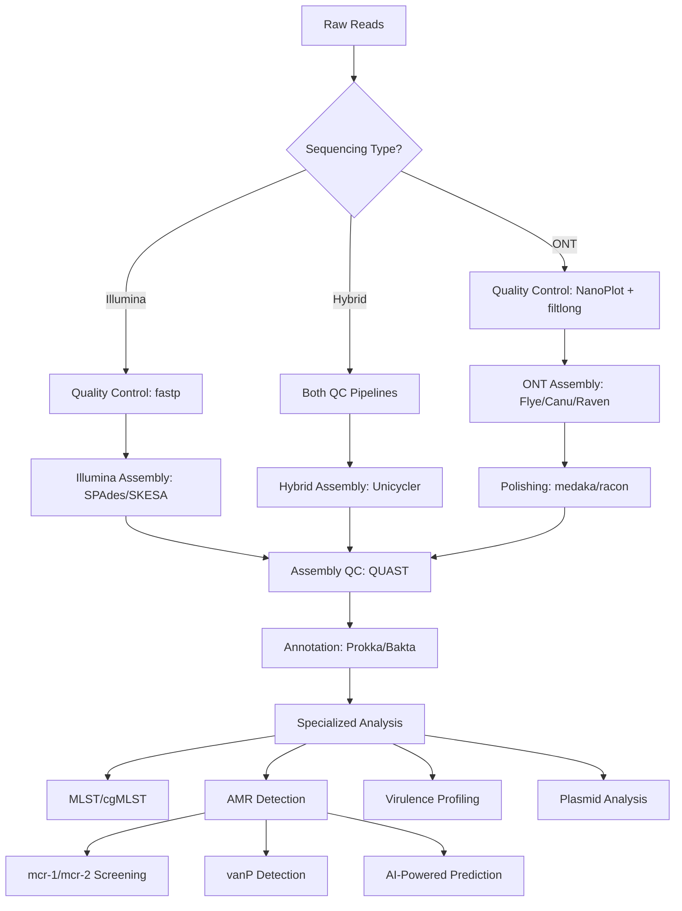

# BacPipe 2.0 - Modernization Plan
## Advanced Bacterial Genomics Pipeline with ONT Support & AI-Enhanced AMR Detection

**Target Repository**: `https://github.com/wholeGenomeSequencingAnalysisPipeline/BacPipe`
**Lead**: BSB (Basil Britto Xavier) - AMR Genomics Bioinformatician, UMCG/DRAIGON Project

---

## 🎯 **Modernization Goals**

### 1. **Sequencing Technology Support**
- ✅ **Illumina**: SPAdes, SKESA, Velvet
- 🆕 **ONT Long-read**: Flye, Canu, Raven, miniasm, medaka polishing
- 🆕 **Hybrid Assembly**: Unicycler, hybridSPAdes

### 2. **Database & Tool Updates (2026)**
- **CARD Database**: v3.3.0+ (comprehensive AMR genes including mcr-1/mcr-2)
- **ResFinder**: Latest CGE version with colistin resistance focus
- **VirulenceFinder**: Updated with Enterococcus vanP genes
- **GTDB-Tk**: Latest taxonomic classification (v2.4+)
- **MLST Schemes**: Updated pubMLST databases
- **PlasmidFinder**: Enhanced mobile genetic element detection

### 3. **AMR-Focused Enhancements**
- 🆕 **mcr Gene Detection**: Dedicated mcr-1/mcr-2/mcr-3+ screening module
- 🆕 **vanP Screening**: Enterococcus vancomycin resistance focus
- 🆕 **AI-Powered Predictions**: Integration with DRAIGON ML models
- 🆕 **Colistin Resistance Profiling**: Phenotype prediction from genotype

### 4. **Modern GUI & Cross-Platform Support**
- **Replace appjar** → Modern web-based interface (React/Electron)
- **Cross-platform**: Windows, macOS, Linux native support
- **Real-time Progress**: WebSocket-based live updates
- **Interactive Results**: Dynamic visualization, export capabilities

### 5. **Infrastructure Modernization**
- **Containerization**: Docker & Singularity support
- **Workflow Management**: Nextflow/Snakemake integration
- **CI/CD Pipeline**: Automated testing and releases
- **Cloud Ready**: AWS/Azure/GCP deployment options

---

## 🏗️ **Technical Architecture**

### **Core Pipeline Structure**
```
BacPipe_2.0/
├── src/
│   ├── core/              # Core pipeline logic
│   ├── assemblers/        # Assembly modules (Illumina + ONT)
│   ├── analysis/          # Post-assembly analysis tools
│   ├── amr/              # Specialized AMR detection
│   ├── gui/              # Modern web-based interface
│   └── utils/            # Utilities and helpers
├── databases/            # Local database management
├── configs/              # Configuration files
├── tests/               # Unit and integration tests
├── docs/                # Documentation
└── docker/             # Container definitions
```

### **New Assembly Workflow**


---

## 🧬 **Enhanced AMR Detection Module**

### **mcr Gene Detection Pipeline**
- **Database**: Custom mcr database (mcr-1 through mcr-10)
- **Screening**: High-sensitivity BLAST + HMM profiles
- **Validation**: PCR primer design for confirmation
- **Reporting**: Detailed genetic context analysis

### **vanP Enterococcus Module**
- **Target**: vanP gene cluster (vanP-1, vanP-2, vanP-3)
- **Integration**: Cross-reference with MLST typing
- **Epidemiology**: Clonal complex analysis

### **AI-Enhanced Predictions**
- **Model Integration**: DRAIGON project ML models
- **Features**: Genomic signatures, resistance profiles
- **Output**: Confidence scores, interpretable predictions

---

## 🖥️ **Modern GUI Design**

### **Technology Stack**
- **Frontend**: React + TypeScript + Tailwind CSS
- **Backend**: Python FastAPI + WebSocket
- **Desktop App**: Electron wrapper
- **Data Viz**: Plotly.js + D3.js for phylogenetic trees

### **Key Features**
- **Project Management**: Multi-sample batch processing
- **Real-time Monitoring**: Live progress updates with ETA
- **Interactive Results**: Clickable resistance genes, downloadable reports
- **Workflow Builder**: Drag-and-drop pipeline customization
- **Export Options**: Multiple formats (Excel, CSV, JSON, PDF reports)

### **User Experience Improvements**
- **One-Click Setup**: Auto-detection of installed tools
- **Smart Defaults**: Context-aware parameter suggestions
- **Error Handling**: Detailed troubleshooting guides
- **Resource Monitoring**: CPU/Memory usage optimization

---

## 📊 **Database Management System**

### **Auto-Update Mechanism**
```python
# Pseudo-code for database update system
class DatabaseManager:
    def check_updates(self):
        """Check for database updates from official sources"""
        
    def download_updates(self, databases: List[str]):
        """Download and validate new database versions"""
        
    def install_updates(self):
        """Install updates with rollback capability"""
        
    def verify_integrity(self):
        """Verify database integrity and indexing"""
```

### **Supported Databases**
| Database | Source | Update Frequency | Auto-Update |
|----------|--------|------------------|-------------|
| CARD | McMaster | Monthly | ✅ |
| ResFinder | CGE | Quarterly | ✅ |
| VirulenceFinder | CGE | Quarterly | ✅ |
| GTDB-Tk | GTDB | Bi-annual | ✅ |
| MLST Schemes | pubMLST | Weekly | ✅ |
| Custom mcr DB | Curated | Manual | ❌ |

---

## 🚀 **Implementation Timeline**

### **Phase 1: Core Infrastructure (Week 1-2)**
- [ ] Repository setup and migration
- [ ] Modern Python architecture (3.11+)
- [ ] Docker containerization
- [ ] Basic CLI interface

### **Phase 2: Assembly Modernization (Week 3-4)**
- [ ] ONT assembler integration (Flye, Canu, Raven)
- [ ] Hybrid assembly support (Unicycler)
- [ ] Quality control updates (fastp, NanoPlot)
- [ ] Polishing pipelines (medaka, racon)

### **Phase 3: Database & AMR Updates (Week 5-6)**
- [ ] Database update system
- [ ] Enhanced AMR detection modules
- [ ] mcr-specific screening pipeline
- [ ] vanP Enterococcus module
- [ ] AI model integration prep

### **Phase 4: Modern GUI Development (Week 7-8)**
- [ ] React-based web interface
- [ ] Real-time progress monitoring
- [ ] Interactive result visualization
- [ ] Electron desktop app packaging

### **Phase 5: Testing & Documentation (Week 9-10)**
- [ ] Comprehensive testing suite
- [ ] Performance benchmarking
- [ ] User documentation
- [ ] GitHub Actions CI/CD

---

## 🧪 **Validation Strategy**

### **Test Datasets**
- **MRSA outbreak data**: Previous BacPipe validation datasets
- **mcr-positive isolates**: Known mcr-1/mcr-2 containing strains
- **Enterococcus vanP**: vanP-positive clinical isolates
- **Mixed Illumina/ONT**: Hybrid assembly validation

### **Performance Metrics**
- **Speed**: Assembly time comparison (Illumina vs ONT vs Hybrid)
- **Accuracy**: Assembly quality metrics (N50, completeness)
- **Sensitivity**: AMR gene detection recall/precision
- **Usability**: GUI responsiveness and error handling

---

## 📈 **Integration with BSB's Research Profile**

### **Publication Opportunities**
- "BacPipe 2.0: Modernized bacterial genomics with enhanced colistin resistance detection"
- "Comparative analysis of ONT vs Illumina assembly for AMR gene detection"
- "AI-enhanced phenotype prediction from bacterial genomes"

### **Conference Presentations**
- ASM Microbe 2026: "Next-generation bacterial genomics pipelines"
- ECCMID 2026: "Real-time mcr detection for infection control"
- Bioinformatics conferences: "Modern workflow management for genomics"

### **Community Impact**
- **Open Source**: Maintained as community resource
- **Training Materials**: Workshops and tutorials
- **Clinical Translation**: Hospital laboratory adoption
- **Public Health**: Outbreak investigation toolkit

---

**Ready to proceed with implementation? Let's start with Phase 1!**
